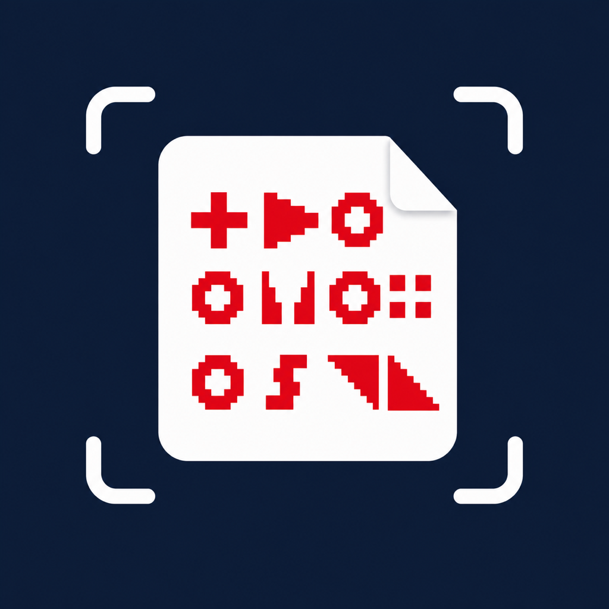

<div align="center">
  

  # LensDrop

  [English](README.md) | **简体中文**

  用 iPhone 接收动态 `cimbar` 码传来的文件。

  [TestFlight 公开测试](https://testflight.apple.com/join/8mEjTABF)
</div>

LensDrop 会扫描电脑屏幕上的动态码图，并在手机本地恢复文件。发送端可以使用 [cimbar.org](https://cimbar.org)、官方 `cimbar_js.html`，也可以使用 LensDrop 设置页导出的离线发送端 HTML。

传输过程走的是相机和屏幕，不需要把文件发到网络上。LensDrop 不会上传收到的文件，也不会上传相机画面。

## 当前状态

这个 App 还在公开测试。如果遇到问题，可以在 [GitHub Issues](https://github.com/xzz1/lensdrop-ios/issues) 里反馈，最好带上：

- 设备型号和 iOS 版本
- 使用的发送端：`cimbar.org`、内置 HTML，还是其他版本
- 文件大小和文件类型
- 扫描页面上的状态，尤其是 decoded / extracted frame 数字

## 使用方法

1. 通过 [TestFlight](https://testflight.apple.com/join/8mEjTABF) 安装，或者自己从源码构建。
2. 在电脑上打开 [cimbar.org](https://cimbar.org) 或离线 `cimbar_js.html` 发送端。
3. 在发送端选择一个文件。
4. 在 LensDrop 中点击 **开始扫描**，把相机对准电脑屏幕。
5. 接收完成后，点击 **保存到文件**。

如果需要完全离线使用，可以在 LensDrop 设置页导出内置发送端 HTML。导出的文件可以直接在桌面浏览器里打开。

## 项目内容

- 用 SwiftUI 写的 iOS 接收端。
- 连接 `libcimbar` 的 Objective-C++ 桥接层。
- 内置官方 `libcimbar` 发送端 HTML。
- 英文和简体中文界面。
- 本地隐私政策和第三方许可说明。

## 构建

需要：

- Xcode 15 或更新版本
- iOS 16 deployment target
- [XcodeGen](https://github.com/yonaskolb/XcodeGen)
- OpenCV iOS framework，放在仓库根目录的 `opencv2.framework`
- Git submodule

```bash
git clone --recurse-submodules https://github.com/xzz1/lensdrop-ios.git
cd lensdrop-ios

# 下载 OpenCV for iOS，并把 opencv2.framework 放到当前目录。
# https://github.com/opencv/opencv/releases

./scripts/generate-xcode.sh
open CimbarApp.xcodeproj
```

建议直接用真机测试。这个项目的核心是相机接收，模拟器没有实际意义。

## 目录

```text
core/                  libcimbar 的 C API 封装
ios/                   SwiftUI app 和 Objective-C++ 桥接层
ios/Resources/         内置发送端 HTML 和许可文件
libcimbar/             上游 libcimbar submodule
project.yml            XcodeGen 工程配置
scripts/generate-xcode.sh
```

## 隐私

LensDrop 在本地工作。它使用相机解码屏幕上的码图；接收到的文件只有在你通过系统文件选择器指定位置后才会写入。

完整说明见 [PRIVACY.md](PRIVACY.md)。

## 致谢

LensDrop 使用 Stephen Zhang 开发的 [libcimbar](https://github.com/sz3/libcimbar)，并兼容 Android [cfc](https://github.com/sz3/cfc) 使用的文件传输格式。

内置的 `libcimbar` 发送端和 `libcimbar` 代码依据 MPL 2.0 分发，许可文件位于 `ios/Resources/Licenses/libcimbar-MPL-2.0.txt`。
